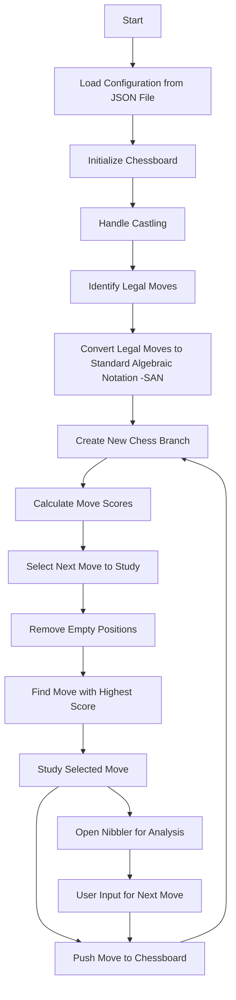

# Use
ChessBookBuilder is a cli tool that can use [Nibler](https://github.com/rooklift/nibbler) (GNU GENERAL PUBLIC LICENSE light Chess program) to visualize the chessboard.

ChessBookBuilder leverages the [Lichess](https://lichess.org) API to help chess players construct personalized chess books. It assists users in prioritizing and learning chess moves from the very beginning of a game. The system selects the next most popular move based on user configuration, including time control and skill level. It dynamically creates branches in your chess repertoire, adapting to statistical probabilities. If there's a higher chance of encountering a new move at a particular point in the game, ChessBookBuilder will guide you through that move.

# Configuration
Modify config.json, follow the comments there.

# Python modules
See requirements.txt

# Activity diagram

